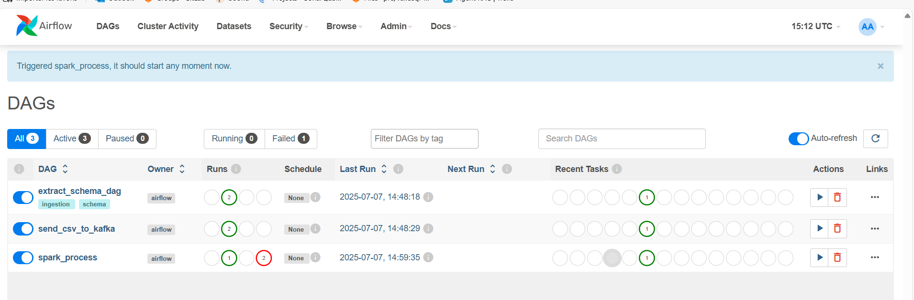
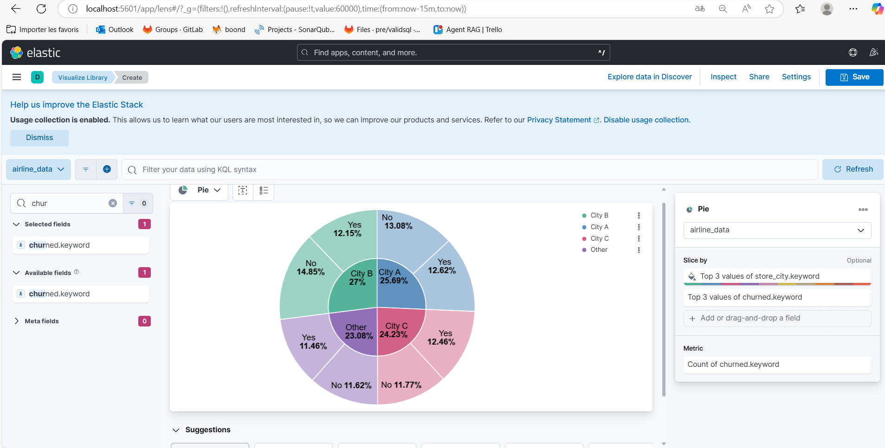
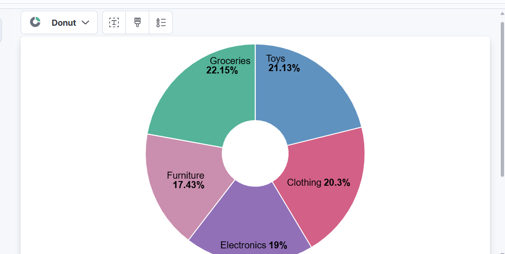
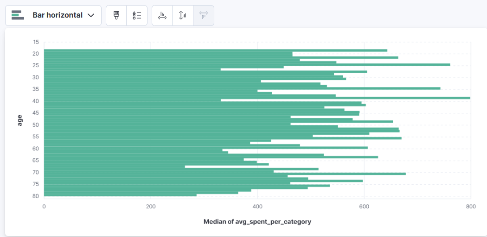
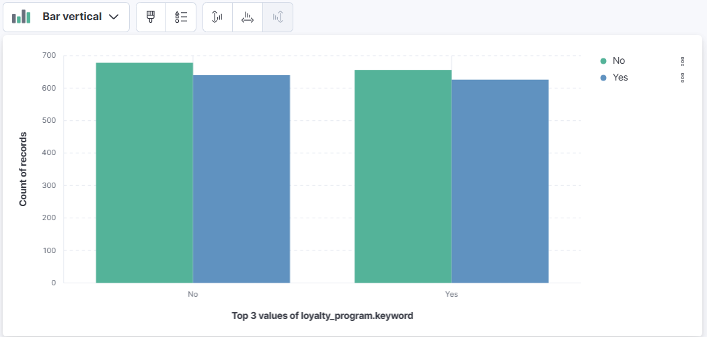
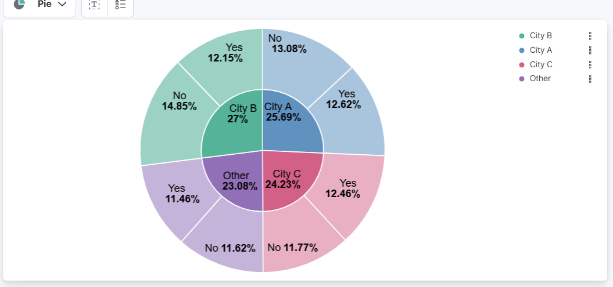

# Big Data Pipeline for Retail Data 

## Tools Used

This project brings together several leading open-source technologies to build a robust, scalable, and real-time big data analytics pipeline:

- **Apache Airflow**: A workflow orchestration platform that allows you to programmatically author, schedule, and monitor data pipelines as Directed Acyclic Graphs (DAGs). Airflow ensures each step of the pipeline runs in the correct order and can be easily managed and monitored.
- **Apache Kafka**: A distributed event streaming platform used for high-throughput, fault-tolerant ingestion of data. In this project, Kafka acts as a message broker, streaming CSV data row-by-row to downstream consumers.
- **Apache Spark**: A powerful distributed data processing engine. Spark reads data from Kafka, applies schema-based parsing, performs aggregations and transformations, and prepares the data for analytics and search.
- **Elasticsearch**: A distributed search and analytics engine. Both raw and processed data are indexed in Elasticsearch, enabling fast, flexible queries and analytics at scale.
- **Kibana**: A visualization and exploration tool for Elasticsearch. Kibana provides an intuitive web interface to create dashboards, charts, and reports from your indexed data, making insights accessible to everyone.

These tools are integrated using Docker Compose for easy deployment and reproducibility, making it simple to run the entire stack locally or in the cloud.

## Overview
This project is a complete big data pipeline for processing, analyzing, and visualizing retail transaction data using modern open-source tools. It leverages Apache Airflow for orchestration, Apache Kafka for streaming, Apache Spark for distributed processing, and Elasticsearch/Kibana for search and visualization.

## Architecture
- **Airflow**: Orchestrates the pipeline as DAGs (Directed Acyclic Graphs).
- **Kafka**: Acts as a message broker for streaming CSV data.
- **Spark**: Consumes data from Kafka, processes and aggregates it, and indexes results into Elasticsearch.
- **Elasticsearch**: Stores both raw and aggregated data for fast search and analytics.
- **Kibana**: Provides a web UI for data exploration and visualization.

## Dataset
The dataset (`retail_data.csv`) contains synthetic retail transaction records with the following fields (see `version/DVM_retail_data_v1.json` for schema):

| Column Name                | Description                                                      |
|----------------------------|------------------------------------------------------------------|
| customer_id                | Unique customer identifier                                        |
| age                        | Customer age                                                     |
| gender                     | Customer gender                                                  |
| income_bracket             | Income category (e.g., Low, Medium, High)                        |
| loyalty_program            | Whether the customer is in a loyalty program (Yes/No)            |
| membership_years           | Years in loyalty program                                          |
| churned                    | Whether the customer has churned (Yes/No)                        |
| marital_status             | Marital status                                                   |
| number_of_children         | Number of children                                               |
| education_level            | Highest education attained                                       |
| occupation                 | Customer occupation                                              |
| transaction_id             | Unique transaction identifier                                    |
| transaction_date           | Date and time of transaction                                     |
| product_id                 | Unique product identifier                                        |
| product_category           | Product category (e.g., Electronics, Clothing)                   |
| quantity                   | Number of items purchased                                        |
| unit_price                 | Price per item                                                   |
| discount_applied           | Discount applied to transaction                                  |
| payment_method             | Payment method (e.g., Credit Card, Cash)                         |
| store_location             | Store location name                                              |
| transaction_hour           | Hour of transaction                                              |
| day_of_week                | Day of the week                                                  |
| week_of_year               | Week number                                                      |
| month_of_year              | Month number                                                     |
| avg_purchase_value         | Customer's average purchase value                                |
| purchase_frequency         | Frequency of purchases (e.g., Daily, Weekly)                     |
| last_purchase_date         | Date of last purchase                                            |
| avg_discount_used          | Average discount used by customer                                |
| preferred_store            | Customer's preferred store location                              |
| online_purchases           | Number of online purchases                                       |
| in_store_purchases         | Number of in-store purchases                                     |
| avg_items_per_transaction  | Average items per transaction                                    |
| avg_transaction_value      | Average value per transaction                                    |
| total_returned_items       | Total items returned                                             |
| total_returned_value       | Total value of returned items                                    |
| total_sales                | Total sales value                                                |
| total_transactions         | Total number of transactions                                     |
| total_items_purchased      | Total items purchased                                            |
| total_discounts_received   | Total discounts received                                         |
| avg_spent_per_category     | Average spent per product category                               |
| max_single_purchase_value  | Maximum value of a single purchase                               |
| min_single_purchase_value  | Minimum value of a single purchase                               |
| product_name               | Name of the product                                              |
| product_brand              | Brand of the product                                             |
| product_rating             | Product rating                                                   |
| product_review_count       | Number of product reviews                                        |
| product_stock              | Product stock level                                              |
| product_return_rate        | Product return rate                                              |
| product_size               | Product size                                                     |
| product_weight             | Product weight                                                   |
| product_color              | Product color                                                    |
| product_material           | Product material                                                 |
| product_manufacture_date   | Product manufacture date                                         |
| product_expiry_date        | Product expiry date                                              |
| product_shelf_life         | Product shelf life (days)                                        |
| promotion_id               | Promotion identifier                                             |
| promotion_type             | Type of promotion (e.g., Flash Sale, 20% Off)                   |
| promotion_start_date       | Promotion start date                                             |
| promotion_end_date         | Promotion end date                                               |
| promotion_effectiveness    | Effectiveness of promotion (e.g., High, Medium, Low)             |
| promotion_channel          | Channel used for promotion (e.g., Online, In-store)              |
| promotion_target_audience  | Target audience for promotion                                    |
| customer_zip_code          | Customer's zip code                                              |
| customer_city              | Customer's city                                                  |
| customer_state             | Customer's state                                                 |
| store_zip_code             | Store's zip code                                                 |
| store_city                 | Store's city                                                     |
| store_state                | Store's state                                                    |
| distance_to_store          | Distance from customer to store                                  |
| holiday_season             | Whether purchase was during a holiday season (Yes/No)            |
| season                     | Season of the year (e.g., Winter, Summer)                        |
| weekend                    | Whether purchase was on a weekend (Yes/No)                       |
| customer_support_calls     | Number of customer support calls                                 |
| email_subscriptions        | Email subscription status (Yes/No)                               |
| app_usage                  | App usage frequency (e.g., High, Medium, Low)                    |
| website_visits             | Number of website visits                                         |
| social_media_engagement    | Social media engagement level (e.g., High, Medium, Low)          |
| days_since_last_purchase   | Days since last purchase                                         |

## Pipeline Steps
1. **Schema Extraction**: `scripts/extract_schema.py` infers the schema from the CSV and generates a JSON schema file.
2. **Kafka Topic Creation**: `scripts/create_kafka_topic.py` creates the necessary Kafka topic.
3. **CSV Ingestion**: `airflow/dags/ingest_csv_to_kafka.py` streams CSV rows into Kafka.
4. **Spark Processing**: `scripts/process_with_spark.py` reads from Kafka, parses and processes the data using the inferred schema, performs aggregations (e.g., average unit price by product category), and indexes both raw and aggregated data into Elasticsearch.
5. **Visualization**: Kibana is used to create dashboards and visualizations from the Elasticsearch indices.

### Successful Pipeline Run Examples

**Airflow DAG Run - All Tasks Succeeded:**



**Elasticsearch and Kibana Services Running:**



## How to Run
1. **Clone the repository**
2. **Configure environment**
   - Edit `docker-compose.yml` as needed for your ports and volumes.
   - Ensure your dataset is in `data/retail_data.csv`.
3. **Build and start the stack**
   ```sh
   docker compose down
   docker compose build
   docker compose up -d
   ```
4. **Access services**
   - Airflow: http://localhost:8080
   - Kibana: http://localhost:5601
   - (Kafka, Spark, and Elasticsearch run as services in the stack)
5. **Run the pipeline**
   - Use Airflow UI to trigger the DAGs in order: schema extraction, topic creation, ingestion, processing.
   - Monitor logs in Airflow and Spark for progress.
6. **Visualize in Kibana**
   - Create a data view (index pattern) for your Elasticsearch index (e.g., `rettail_data` or `rettail_data_raw`).
   - Use Discover and Visualize to explore and chart your data.

## Visualization Examples

Below are example visualizations created in Kibana from the processed retail data. 





## Customer Analysis Visualizations

Explore customer behavior and churn with the following visualizations:
  
- **Churn by Loyalty Program:**
  
  
  *Description:*
  This vertical bar chart visualizes the relationship between customer churn and loyalty program membership. The X-axis shows whether customers are part of a loyalty program (Yes/No), and the Y-axis represents the count of records. Each bar is split by churn status, allowing you to compare the number of churned and non-churned customers within each loyalty program group. This helps identify if loyalty program participation has an impact on customer retention.

- **Churn by City:**

  
  
  *Description:*
  This sunburst pie chart displays the distribution of customer churn across different cities. The inner ring represents the city (e.g., City A, City B, City C, Other), and the outer ring splits each city by churn status (Yes/No). The percentage labels show the proportion of each group within the total customer base. This visualization helps you quickly identify which cities have higher or lower churn rates and compare churn behavior across locations.

## File Structure
```
docker-compose.yml
airflow/
    Dockerfile
    requirements.txt
    dags/
        extract_schema_dag.py
        ingest_csv_to_kafka.py
        process_with_spark_dag.py
    ...
data/
    retail_data.csv
    output_es/
kafka/
    entrypoint.sh
    kafka.properties
scripts/
    create_kafka_topic.py
    extract_schema.py
    process_with_spark.py
version/
    DVM_retail_data_v1.json
```

## Customization
- To change the aggregation or processing logic, edit `scripts/process_with_spark.py`.
- To use a different dataset, place your CSV in `data/` and re-run the schema extraction.
- To add new visualizations, use Kibana’s dashboard features.

## Requirements
- Docker and Docker Compose
- (Optional) Python 3.x for running scripts locally

## Installation / Prerequisites

Before running this project, ensure you have the following software installed:

- **Docker** (version 20.10+ recommended)
- **Docker Compose** (v2+ recommended, or included with recent Docker Desktop)
- **Python** (3.8 or higher, only required for running scripts locally)
- **Git** (for cloning the repository)

### System Requirements
- At least **8 GB RAM** (16 GB recommended for large datasets or multiple services)
- At least **4 CPU cores** recommended
- **10+ GB free disk space** for Docker images, data, and logs

### Example System Properties
- **Processor:** 13th Gen Intel(R) Core(TM) i5-13420H @ 2.10 GHz (8 cores)
- **RAM:** 24 GB (23.7 GB usable)
- **System Type:** 64-bit OS, x64-based processor

These specs are more than sufficient for running the full pipeline, even with large datasets and multiple services running in Docker.

### Windows Users
- It is strongly recommended to use **WSL 2 (Windows Subsystem for Linux)** with Docker Desktop for best compatibility and performance.
- Enable WSL 2 integration in Docker Desktop settings.
- All commands in this README can be run from a WSL terminal (Ubuntu or other supported Linux distros).

### Additional Notes
- Ensure virtualization is enabled in your BIOS/UEFI for Docker to work properly.
- If running on Mac, use Docker Desktop and ensure resource limits are set appropriately.
- For Linux, install Docker and Docker Compose using your distribution's package manager or the official Docker instructions.

## Credits
- Built with Apache Airflow, Kafka, Spark, Elasticsearch, and Kibana.
- Dataset is synthetic and for demonstration purposes only.

## Contributors
- Sirine Jnayeh
- Ghassen Abed ([Ghassen2001](https://github.com/Ghassen2001))

## License
MIT License. See LICENSE file for details.
